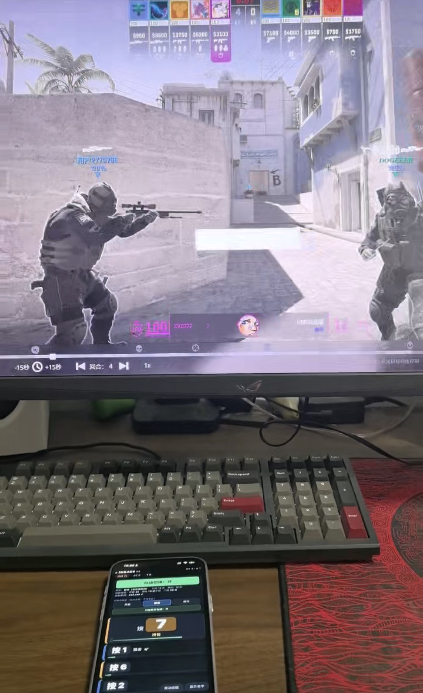
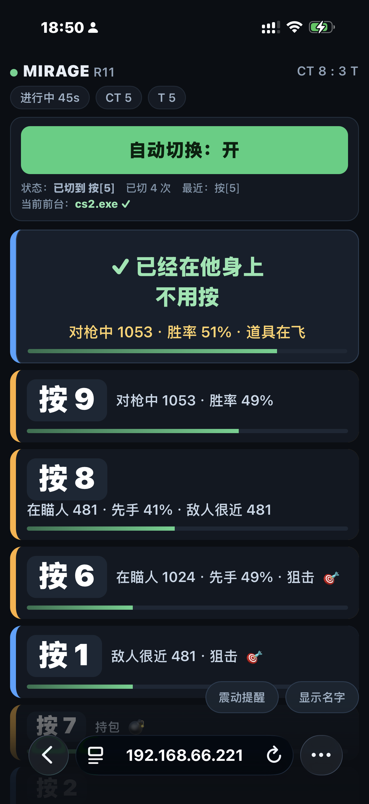
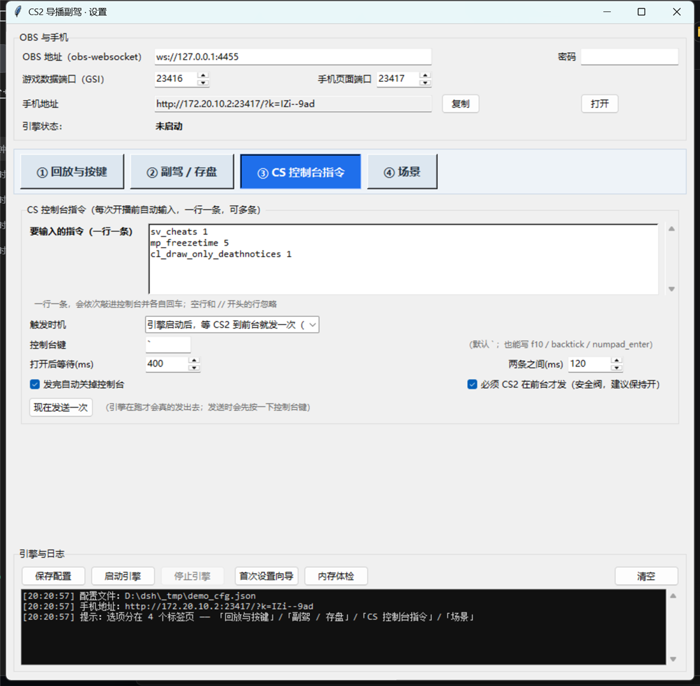
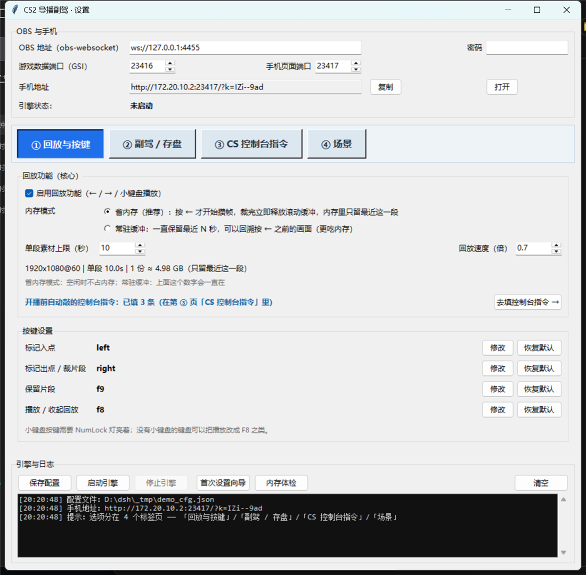
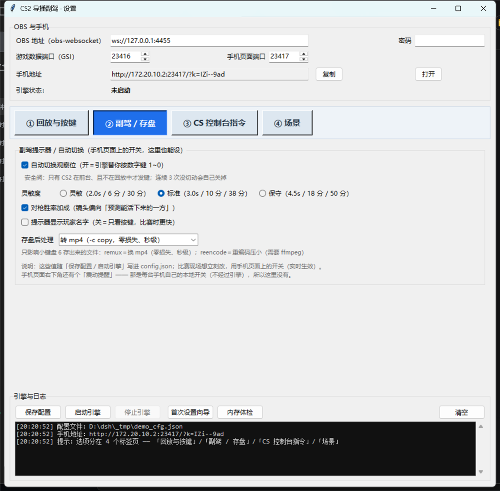
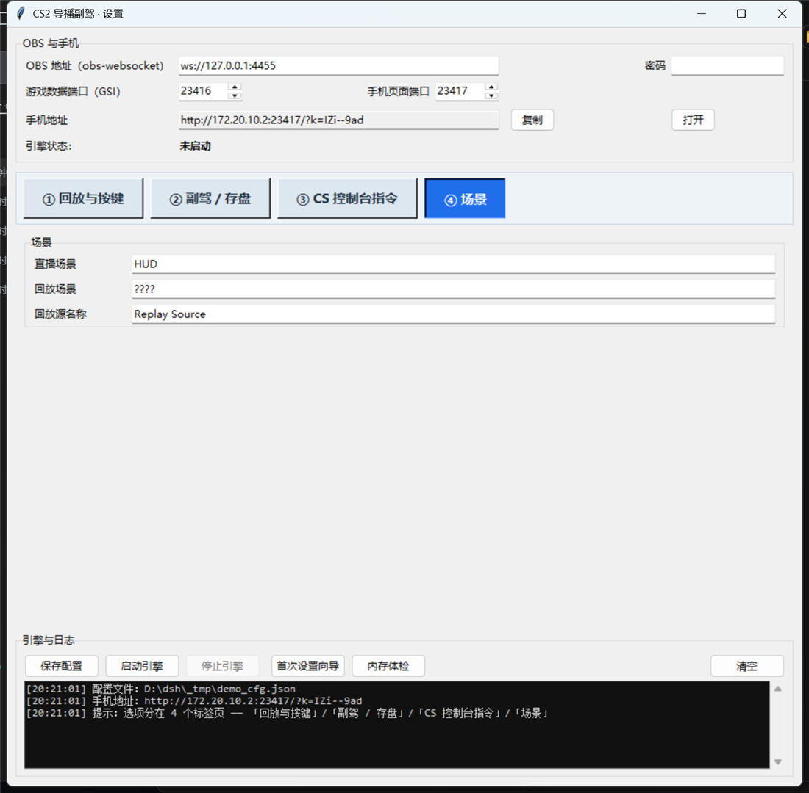

# smart-CS2-OB · CS2 自动导播助手

**镜头自动跟着交火走 · 精彩段落两键成片 · 手机实时提示。**

导播一场 CS2 比赛，同时要干三件事：盯着谁在打、把观察位切过去、把刚打完的那一段回放出来。
一个人干这些基本等于手忙脚乱 —— 镜头切晚了、回放抓早了、精彩镜头全漏了。

这个工具把这三件事压成**一个开关 + 两个键**：

| 你原本要干的 | 现在 | 怎么开 |
|---|---|---|
| 判断"该把镜头给谁"，再按 `1`~`0` 切 POV | **镜头自动跟着交火走**，引擎替你按数字键 | 打开**自动切换**（见 [① 自动切换镜头](#auto-switch)） |
| 边打边惦记"这段得录下来" | 打之前按 `←`、打完了按 `→`，这一段**当场**成片，播放键一按就播 | 打开**回放功能**（见 [③ 一键回放](#replay)） |
| 腾不出手看谁在打 | **瞄一眼手机**，上面写着大字「按 [ 7 ]」和理由 | 手机连同一个 WiFi，打开日志里那行地址（见 [② 手机副驾提示器](#phone)） |
| 开播前往控制台敲一串指令 | 引擎替你"开控制台 → 逐条敲 → 关掉" | 设置窗口 ③ 页一行一条（见 [④ CS 控制台指令](#console)） |

> **两个开关出厂都是关的**，理由不是偷懒：
> 「自动切换」要往游戏里**注入按键**，「回放功能」要在内存里**攒住最近 N 秒的画面** ——
> 这两件事都该由你亲眼确认一次再打开。打开一次就写进配置，以后每次启动都是开着的。

<p align="center">
  
  
</p>

<p align="center"><i>左：实战场景（OBS 在放回放，HUD 叠加层跟着一起回放）。右：手机端提示器。</i></p>

---

## 🚀 开箱即用（第一次用就照这一段做）

**包里带齐了所有依赖**：Python、`websocket-client`、图形界面、**连 ffmpeg 都在里面**（省内存的那个
OBS 后端要用它裁片段）。所以对方电脑上**什么都不用装** —— 不装 Python、不装 ffmpeg、不装插件。

### 详细的图文步骤看这里 → **[新手教程.md](新手教程.md)**

（压缩包里也放了这一份，解压就能看到；下面只是最精简的四步。）

```
① 解压 CS2导播助手.zip  →  得到 CS2导播助手\ 文件夹（整个文件夹一起用，别只拷 exe）
② OBS 里勾一次：设置 → 输出 → 回放缓冲 → 启用 + 最长回放时间 20 秒 → 重启 OBS
③ 双击「先运行我-首次设置.cmd」→ UAC 点「是」→ 看到 "🎉 全部就绪！"
④ 双击「开始导播.exe」→ 设置窗口里：勾「回放功能」、回放后端选「OBS 自带 Replay Buffer」、
   按需改键/开自动切换 → 点「启动引擎」→ 手机打开日志里那行地址
```

| 你想要 | 在哪设 |
|---|---|
| **画面自动跟着交火走** | 设置窗口「② 副驾 / 存盘」勾「自动切换观察位」（或手机页面下方那个大按钮） |
| **回放只占几十 MB 内存** | 设置窗口「① 回放与按键」→ 回放后端选 **OBS 自带 Replay Buffer**（需要上面第 ② 步） |
| **一台机器什么都不想装** | 就这样用 —— ffmpeg 已经在文件夹里了（`ffmpeg.exe`，和 `开始导播.exe` 同级） |

> 打包的人注意：`python build_exe.py` 会自动把仓库根目录的 `ffmpeg.exe`（或 PATH 里的）
> 复制进成品文件夹再打 zip，所以发出去的包才是真正开箱即用；不想要就加 `--no-ffmpeg`。
> 随包的 ffmpeg 是第三方程序（GPLv3），许可证和来源说明在 `docs/ffmpeg-说明.txt` +
> `docs/ffmpeg-LICENSE.txt`，会一起放进包里。

---

## 30 秒上手

### 拿到的是成品（推荐，不需要装 Python）

> 拿到 **`CS2导播助手.zip`**（约 49 MB，**自带 ffmpeg**）就先解压；
> 拿到的是整个 `CS2导播助手\` 文件夹就直接用（**别只拷 exe**，`_internal\` 必须一起）。

```bat
:: 1. 先打开 OBS（不用开播）
:: 2. 第一次用：双击
先运行我-首次设置.cmd
::      UAC 弹窗点「是」，看到 "🎉 全部就绪！" 就成了
:: 3. 以后每次开播：双击
开始导播.exe
::      弹出的是【设置窗口】→ 按需改键 / 打开「回放功能」和「自动切换」→ 点「启动引擎」
```

引擎起来后，日志里会打印一行手机地址，形如：

```
http://192.168.66.221:23417/?k=你的口令     ← 一般是这个
```

手机连同一个 WiFi，打开这个地址（**`?k=` 一起带上**，口令是保护"自动切换"开关不被同网段的人乱点），
加进主屏幕书签，以后一点就开。

### 从源码跑

```bat
git clone https://github.com/DOGEEER6/smart-CS2-OB.git
cd smart-CS2-OB
pip install websocket-client
python setup_wizard.py                :: 首次设置（--check 只自检、--dry-run 演练）
python replay_director.py             :: 双击 exe 一样：开设置窗口，点「启动引擎」开跑
python replay_director.py --no-gui    :: 不开窗口，直接命令行跑引擎
```

> 图形界面需要 Python 自带的 `tkinter`（官方安装包默认有）。没有也能跑，只是没窗口：用 `--no-gui`。

### 自己打成 exe

```bat
pip install pyinstaller websocket-client
python build_exe.py --clean
:: 产物：CS2导播助手\  和  CS2导播助手.zip（直接当 GitHub Release 附件）
::      默认会把 ffmpeg 一起打包进去（开箱即用）；不想带就加 --no-ffmpeg
```

> 默认打**文件夹版**（onedir）。单文件版（`--mode onefile`）每次启动都要解压到 `%TEMP%`，
> 一旦被组策略 / 杀软 / 沙箱拦就整个起不来，只报一句 `Could not create temporary directory!`，
> 排查代价极高。**建议就用文件夹版。**

### 首次设置向导做了什么

| 步骤 | 干什么 | 安全设计 |
|---|---|---|
| 1 | 找 CS2 安装目录 | 读 Steam 注册表，自动定位游戏库 |
| 2 | 装 GSI 配置 | 只写 `game\csgo\cfg\`，**不碰**老版 CS:GO 残留的 `csgo\cfg\` |
| 3 | 读 obs-websocket 端口和密码 | 直接读 OBS 自己的配置文件，**不用手抄密码** |
| 4 | 检查回放插件 | 装了就说装好了、没装就明确告诉你去装哪个（**只影响回放**，见下） |
| 5 | 认场景 | 自动认出直播场景；回放场景 / 回放源缺了就建一个 |
| 6 | 写插件参数 | **只写空着的或明显不对的**，你已经调好的值一律保留 |
| 7 | 放行手机访问 | 加一条防火墙入站规则，`remoteip=LocalSubnet` 只放行局域网 |
| 8 | 端到端自检 | 逐项告诉你哪里还没通 |

**对已经配好的系统零改动**，重复跑是安全的。

> 📌 **回放插件是"可选"的**：自动切换镜头和手机提示器**完全不需要**插件。
> 只有选了"插件后端"来回放时才需要 [exeldro/obs-replay-source](https://github.com/exeldro/obs-replay-source)；
> 用「OBS 自带 Replay Buffer」后端则不需要插件，但要本机有 ffmpeg。

---

<a id="auto-switch"></a>

## ① 自动切换镜头（主功能，最省事的一档）

**一句话：引擎按 GSI 每 100ms 收到的比赛数据给 10 个人打分，把"现在最值得看的那个人"对应的
观察位数字键（`1`~`0`）替你按下去 —— 镜头就跟着交火走了。**

```
CS2（观战模式）──GSI(100ms)──▶ 打分/分层/胜率 ──▶ 该给谁？
                                                  ├─▶ 📱 手机：大字「按 [ 7 ]」+ 理由
                                                  └─▶ ⌨️ 自动切换开着时：替你按 7
```

### 怎么打开

| 在哪 | 怎么操作 |
|---|---|
| **📱 手机页面**（推荐，比赛进行中也能改） | 下方那个「**自动切换：开 / 关**」大按钮，点一下就生效，不用重启引擎 |
| 🖥️ 设置窗口 | 标签页「**② 副驾 / 存盘**」→ 自动切换开关 + 灵敏度三档 + 对枪胜率加成 |
| ⚙️ 配置文件 | `config.json` 里 `"auto_switch": true` |

> 手机上的开关是**即时生效**的；带 `?k=` 口令的完整地址才能点（防止同网段的人乱开）。

### 它凭什么知道该给谁

#### 第一步：每个 GSI 包给 10 个人打分

GSI 的 `allplayers` 里有**位置**和**朝向**（`forward`），所以能算出"他在瞄谁"：
朝向夹角用 `atan2(forward[0], forward[1])` 求。

| 信号 | 分值 | 含义 |
|---|---|---|
| `taking_damage` | **70** | 这一包血量掉了 —— 最强信号，他正在挨打 |
| `mutual_aim` | **60** | 他和他面前的敌人互相在瞄 —— 对枪一触即发 |
| `aiming_enemy` | 25 | 他在瞄一个敌人（单向，例如架枪） |
| `enemy_very_close` | 25 | 最近敌人 < 500 单位 |
| `just_killed` | 30 | 3 秒内刚拿到击杀 |
| `last_alive` | 25 | 自己队只剩他一个（残局） |
| `nade_incoming` | 18 | 附近有飞行中的道具 |
| `flashed` | 15 | 被闪了 |
| `has_bomb` | 14 | 拿着 C4 |
| `enemy_close` | 12 | 最近敌人 < 1000 单位 |
| `near_bomb_ct` | 12 | 已下包，他离包很近（拆包位） |
| `low_hp` | 10 | 残血 |
| `sniper` | 8 | 拿狙击 |
| `observed` | 6 | 当前正在看的这个（轻微粘性，防抖） |
| `STICKY_BONUS` | 14 | 上一包的第一名给点加成，防止列表闪烁 |

#### 第二步：交火主导权 + **分层**（最关键的修正）

只按分数相加会出大问题：

```
架枪的人       = aiming_enemy 25 + enemy_very_close 25         = 50
包匪+残局+包点 = has_bomb 14 + last_alive 25 + near_bomb_ct 12 = 51
真在打的人     = mutual_aim 60                                 = 60
```

实测复现过：`只按分数排 → 对枪 A 172 / 架枪 D 173`，差 1 分就切错了。
结果就是 —— **有人正打着，镜头却切到后面拿包的残局哥身上**。

修法是两层：

**① 交火主导权**：只要他正在参与一场即将发生的交火，额外加一大笔分。

```
强交火（互相瞄 / 正在掉血） → +130，并且锁定镜头不许切走
弱交火（单向瞄且敌人很近）  → +70，压得过静态叙事，但不锁镜头
```

**② 层级优先于分数**：排序键是 `(tier, -score)`，不是单纯比分数。

| 层级 | 条件 |
|---|---|
| **tier 0** 真在打 | **互相瞄**（对枪，1800 单位以内）；或**最近 1.5 秒内挨过打，且附近（<1600 单位）真有敌人** |
| **tier 1** 对峙 | 在瞄人 且 距离 < 1600 |
| **tier 2** 其余 | 按叙事价值排（残局、拿包、连杀…） |

于是"架枪的"哪怕叠满静态信号（实测能叠到 243 分），也**永远排在 tier 0 的真交火后面**。
自动切换端也配合：层级跃升时**绕过**分数门槛和领先差值，因为真打起来了必须切；
反过来——**正在看的人层级更高时，别人分再高也不切**（2026-10-09 加，见下）。

> ⚠️ GSI **不提供视线遮挡信息**，"在瞄人"只有角度判定 —— 隔墙把准星对着附近敌人也会触发。
> 所以有强弱之分：隔墙瞄人只拿 70 分、不锁镜头，不会把画面焊死。

#### 四个"镜头乱切 / 错过交火"的坑（2026-10-09 用户反馈后修掉）

用户反馈过两次，方向正好相反：**"别人在对枪，镜头却切到架枪的人"** 和
**"经常错过交火镜头，回均错过两三个，镜头一直给远处走路的人"**。查下来是四个坑：

| 坑 | 现象 | 修法 |
|---|---|---|
| **掉血 ≠ 在打** | 远距离流弹、火烧、摔伤都会让血量掉 → 一个根本不在打的人拿到第 0 层 + 130 分，把真正的对枪挤掉 | 掉血要**附近（<1600 单位）真有敌人**才算第 0 层；否则只按"在瞄人"算 |
| **中距离对枪被降级** | 1200~1800 单位的对枪原来只算第 1 层（+70），打不过上面那个"蹭到一下"的第 0 层 | 互相瞄的第 0 层距离放宽到 1800（**锁镜头**仍只在 1200 以内生效），靠"越近越紧急"的加分在几场交火间排先后 |
| **掉血是断续的** | GSI 只有 10Hz，"掉血"只在**中弹的那几包**出现 → 对枪的人在没中弹的那几包掉层，镜头被抢走、下几包又抢回来（现场就是"莫名其妙切走"） | 掉一次血记一个时间戳，**1.5 秒内都算"正在挨打"**，层级不再抖 |
| **"部分包"让对枪的人凭空消失** | CS2 隔几个包就发一次"只有 id/team"的包（见[技术笔记](docs/技术笔记.md) §3.4）。镜头模型原来直接读原始包，那些包里选手**没有血量/位置/朝向** → 直接被跳过 → 一半的包都在"看不见交火"，剩下的静态分最高者（常常是远处走路的）顶上来 | 评分前先**合并上一包的字段**（位置最多旧 100ms，但人不会消失、瞄没瞄算得出来） |
| **停留时间挡住了"刚打起来"** | 镜头刚切到走路的（第 2 层），1 秒后别处真打起来（第 0 层），但"最小停留 3 秒"没到 → 整段错过 | **真交火可以绕过停留时间立刻切**（防抖不该挡交火） |

还有一条护栏：**自动切换端不许切到层级更低的人**。以前只有"层级跃升"能绕过分数门槛，
反方向没有护栏 —— 一个层级 2 的人只要静态分叠得够多（残局 + 持包 + 刚击杀 + 道具在飞…）
照样能把镜头从正在对枪的人身上抢走。现在：**层级低的永远抢不走层级高的**。

> 日志里现在每次切换都会写清理由和层级，例如
> `🎯 自动切换 → 按 [7]  对枪中 1053 · 胜率 51%  分数 268 · 第0层` ——
> 再遇到"切得莫名其妙"，把这几行发出来就能直接对账。

#### 第三步：对枪胜率（镜头偏向"能活下来的一方"）

带一个启发式的胜率模型（**可解释，不是黑盒**）：

```
power = hp × 0.78 + 护甲×6 + 头盔×4 + 武器威力(距离) × 0.52
       − 被闪 22 − 着火了 8 ± 本场 K/D 项 ± 本轮伤害项
prob  = 1 / (1 + exp(−(powerA − powerB) / 22))

加成 = 42 × (prob − 0.5) × 2 × mul     mul = 1.0 互相瞄 / 0.5 单向先手
```

单元测试覆盖：满血 AK vs 残血 AK → 92%；对等 → 50%；AWP 远 63% / 近 36%；
手枪 vs 步枪 26%；被闪 27%；霰弹贴脸 52%；本场 KD 2.5 vs 0.4 → 63%。

> 武器威力按 **(远距离, 近距离)** 两档建表。**只认 `state == "active"` 的那把** ——
> GSI 的 `weapons` 字典会残留以前捡过的枪（实测：手里是 `glock`，栏位里躺着 `awp`），
> 按整个武器栏判定会把拿手枪的人算成 AWP 选手，还会连带毁掉胜率预测。
>
> 不想让镜头偏向"稳赢的那一方"？把「对枪胜率加成」关掉就是纯看谁在交火。

#### 第四步：安全阀（自动切镜头最要紧的部分）

- **只有 CS2 在前台才发按键**（`auto_require_focus`，前台进程名必须是 `cs2.exe`）。
  否则合成的数字键会打进 OBS，乱切场景 —— 这条是默认开、强烈建议别关。
- **切完 1.2 秒内回查 GSI 的 `observer_slot`**，看镜头是不是真切过去了。
  **连续失败 3 次就自动关闭自己**，并打印排查步骤（游戏没焦点 / 键位没绑 / 安全软件拦截）。
- 正在回放、以及"tier 0 近距离互相瞄"锁镜头时不切。
- 按键用 `SendInput` + **扫描码**（`KEYEVENTF_SCANCODE`）注入，不是 `keybd_event`。
  （验证方式：自己装一个键盘钩子去抓注入的 `7` —— 钩子能抓到，说明通路可用。）
- **你随时可以接管**：手动把场景切到别处（或按 `/control/lock`）引擎就让位，
  并在 `manual_lock_seconds`（默认 45 秒）后自动交还。

### 三档灵敏度（手机 / 设置窗口里随时切，不用重启）

| 档位 | 最小停留 | 领先多少分才切 | 分数门槛 | 适合 |
|---|---|---|---|---|
| **灵敏** | 2.0 s | 6 分 | 30 分 | 交火密集，想跟紧 |
| **标准** | 3.0 s | 10 分 | 38 分 | 默认 |
| **保守** | 4.5 s | 18 分 | 50 分 | 觉得切得太乱 |

切得太勤 → 往「保守」调；觉得镜头老不跟手 → 往「灵敏」调。
真打起来（tier 0）时这些门槛都会被绕过 —— 门槛只用来过滤"没在打的时候"。

---

<a id="phone"></a>

## ② 手机副驾提示器

<p align="center"></p>

浏览器打开就用，**不用装 App、不会被应用商店拦、不打断游戏操作**：纯 HTML + SSE 长连接，
手机端原生 `EventSource`，无框架无依赖。地址里的 `?k=口令` 存在 `viewer_token.txt`，**重启不变**（书签长期有效）。

从上到下：

- **顶部大开关「回放功能：开 / 关」** —— 等于设置窗口里那个勾选框，手机上随时切。
  下面一行显示当前键位和内存状态，再下面是「**省内存** / **常驻缓冲**」两个按钮，随时切内存模式。
- **顶部倒计时横幅** —— 按了 `←` 标入点之后，它替你数着缓冲还剩多少：
  `⏺ 入点 3.2 秒 / 还剩 6.8 秒内按 →`（蓝）→ `⏸ 快按 → ！`（黄闪 + 震一下）
  → `⚠️ 入点已经滚出缓冲`（红闪 + 再震一下）→ `✅ 片段已裁好 长 9.8 秒`。
- **78px 的巨大「按 [ N ]」** —— 这就是"现在该按几号键"。如果镜头已经在他身上，显示「✓ 已经在他身上 / 不用按」。
- **理由** —— 例如 `对枪中 1053 · 胜率 51% · 道具在飞`。数字是距离（游戏单位）。
- **第 2 ~ 第 5 名** —— 每条同样写着按几号和为什么，方便预判下一个该给谁。
- **击杀播报** —— `⚔ 按 [ 4 ] 拿了第 2 杀 ak47`。
- **下方三个开关**（「自动切换」是那个大按钮，另外两个是小按钮）：

| 开关 | 作用 |
|---|---|
| **自动切换** | 打开后引擎替你按数字键，镜头自己跟着走（见 [①](#auto-switch)） |
| **震动提醒** | 出现新的高优先目标时手机震一下 |
| **显示名字** | 默认关闭；打开才显示玩家 ID（比赛时看键位比看 ID 快） |

> 提示器本身是**只读**的：页面只显示状态，唯一能改东西的是那几个开关，而且必须带口令
> （`/auto?k=TOKEN&on=1`）。同网段的人最多看一眼画面状态，切不了你的场景。

---

<a id="replay"></a>

## ③ 一键回放（两种后端）

**打之前按 `←` → 打完了按 `→` → 想放的时候按播放键。** 就三步。

| 键（默认） | 动作 | 配置字段 |
|---|---|---|
| **`←`** | **标记入点** —— 记住这一刻（精彩镜头开始的地方） | `keys.mark_in` |
| **`→`** | **标记出点 / 裁片段** —— 当场把"入点 → 现在"裁成一段片子 | `keys.mark_out` |
| **小键盘 `Enter`** | **播放 / 收起回放** —— 切到回放场景播放；再按一下立刻切回直播 | `keys.play` |
| **小键盘 `6`** | **保留片段** —— 把当前这段存成视频文件（赛后能剪出去发） | `keys.save` |

> 四个键**都能改**（60% / TKL 键盘没有小键盘？把播放改成 `F8`、留档改成 `F9` 就行）——
> 见 [按键可改](#keys)。

### 先决定"回放功能"开不开（默认关）

`config.json` 的 `replay_enabled` 默认 `false`：关着时四个回放键**只打一行提示、不动手**，
并把插件的滚动缓冲摘掉（`ReplaySource.Disable` + `Clear`）—— 那份几 GB 的内存真的还回去。
**手机提示器和自动切换不受这个开关影响**，照常工作。

三种打开方式：设置窗口的勾选框、手机页面顶部的大开关、`--replay on --save-bind`。

### 选一个回放后端

放的是"最近 N 秒的画面"，两种存法：

| | **插件后端**（默认） | **OBS 后端** |
|---|---|---|
| 靠什么 | [exeldro/obs-replay-source](https://github.com/exeldro/obs-replay-source) | OBS **自带**的 Replay Buffer |
| 内存里存 | **未压缩原始帧**（4 字节/像素） | **编码后**的数据（几十 Mbps） |
| 内存（1080p60 十秒） | 4.98 GB/份 × 2 ≈ **9.95 GB** | ≈ **100 MB**（按 40 Mbps 编码估，码率低就更小） |
| 内存（4K60 十秒） | 19.9 GB/份 × 2 ≈ **39.8 GB** | ≈ **100 MB**（4K 也是编码后的数据，同一量级） |
| 画质 | 原始帧，零损失 | 多一代 NVENC 编码（码率给足时肉眼无感），**裁切 `-c copy` 零损失** |
| 裁 `←``→` | 内存里搬指针（瞬时） | 让 OBS 存缓冲文件 + ffmpeg 裁：真机整段约 **2.4 秒**（等落盘 ~2 秒 + 裁切 0.1 秒） |
| 任意入点定格 / 倒放 | ✅ | ⚠️ 按关键帧对齐（`trim_mode=exact` 可精确到帧） |
| 额外要求 | 装插件 | OBS 里**启用回放缓冲** + 本机 **ffmpeg** + 回放场景有个**媒体源**（引擎自动建） |

**在哪切**：设置窗口 → ① 回放与按键 → 「回放后端」。

**OBS 后端的一次性配置**：设置 → 输出 → **回放缓冲** → 勾选启用，
「最长回放时间」设成 **单段上限的 2 倍**（要 10 秒就设 20 秒 —— 原因见下面那条实测规律），
编码器选 NVENC、码率给足（40 Mbps 起）；
**勾完请重启一次 OBS**（这个输出是 OBS 启动时创建的；不重启就按 `←` 会看到
`Replay buffer is not available`）。关键帧间隔设 1 秒的话，裁出来的入点会更准。

**ffmpeg**：`winget install Gyan.FFmpeg`，或者从 [ffmpeg.org](https://ffmpeg.org/download.html)
下 zip 后把 `bin` 加进 PATH —— **或者最省事：直接把 `ffmpeg.exe` 放到本程序目录旁边**
（引擎会自己找到它，不用改 PATH；发给别人时也这么干）。

> 没有 ffmpeg 时引擎会**自动退回插件后端**接着用（你 OBS 里装了 Replay Source 的话），
> 并在日志里说清原因 —— **回放不会因此整段失效**，也不会让你去手改 `config.json`。
> 两个后端都用不了才会报"回放暂时不可用"（自动切镜头和手机提示器不受影响）。

> **真机验证（OBS 32.x / 1080p60 / NVENC / 回放缓冲 20 秒）**：
> 按 `←` 攒帧 → 按 `→` 裁 8 秒 → 播放 → 播完自动切回 → 留档，逐秒抽帧核对内容无误；
> `trim_mode=exact` 也验过：入点对齐到**完全相同的帧**（原始文件 t=8.0s 与片段首帧都是 `SEC 42`）。
>
> ⚠️ **实测规律：OBS 实际留住的比设置值略少**（设 20 秒 → 存出来 16.6~19.1 秒，
> 它按关键帧粒度丢最老的包）——所以时长要设成单段上限的 2 倍。
> 引擎不猜数字：一律按**文件真实时长**报数、按真实时长算播放长度。
>
> 引擎还会体检：读不到 OBS 的缓冲时长就直接读 OBS 配置文件；小于单段上限会警告；
> 裁完**自动删掉** OBS 那份原始文件（它每存一次就新写一个，一场比赛能攒几个 GB），
> 录像目录里始终只剩当前这一段的 `_clip.mp4`。

<a id="memory"></a>

### 内存：那几 GB 从哪来（不是内存泄漏）

> 这是被问得最多的一件事："为什么每次用这个插件都占 10 G？"
> 结论：**不是泄漏**，是回放插件的设计 —— 它把最近 N 秒的**未压缩**帧放在内存里。

算法就一个乘法：`画布宽 × 高 × 4 字节(BGRA) × 帧率 × 秒数`，而且**同时留两份**
（正在回填的滚动缓冲 + 已经取出来的那一段）：

| 画布 | 时长 | 每帧 | **一份** | 两份 ≈ |
|---|---|---|---|---|
| 1080p @ 60 | 10 秒 | 7.9 MB | **4.98 GB** | **9.95 GB** |
| 4K @ 60 | 10 秒 | 31.6 MB | 19.9 GB | **39.8 GB** |

> 对比一下：相机拍的 4K 视频十秒才几十 MB，因为它存的是**编码后**的
> （H.264/HEVC，~50–100 Mbps）；这个插件为了做到"瞬间定格、任意入点真跳、倒放"，
> 存的是**原始帧**还每帧做一次 GPU→CPU 回读（源码 `replay-filter.c:9/35`）。
> ⚠️ 旧版本日志里写的"1080p 约 1.9 GB"是错的（差 5 倍），已修正。

**三个会"悄悄让内存翻倍"的插件设置**（引擎启动时会自动核对并纠正）：

| 设置 | 后果 |
|---|---|
| 插件的 `Maximum replays`（1~10） | 每多留一段就多**一整份** |
| 插件的 `Capture internal frames` | 开着通常**再多一份** |
| 场景里存在**多个** `replay_source` 实例 | 每个实例**自己攒一份** |

<a id="guards"></a>

### 三道护栏（2026-10-08 加，都在设置里能看/能关）

| 护栏 | 什么时候动手 | 做什么 |
|---|---|---|
| **内存护栏** `memory_guard` | 启动引擎 / 打开回放功能时 | 按**本机内存 + OBS 真实画布**算一遍：装不下就**自动把单段上限降到装得下的值**；高分辨率画布下连 4 秒都装不下 → **直接拒绝开回放**并告诉你怎么降画布 |
| **资源哨兵** `resource_watch` | 运行期间每 ~2 秒 | 可用内存 <12% 打警告；<6% → **主动把滚动缓冲放掉**（先把我们占的几 GB 还回去），免得整机换页把直播也拖死 |
| **磁盘护栏** | 打开回放功能时 | 系统盘 <2 GB → 拒绝开回放（页面文件都写不进去，必卡）；<8 GB → 警告 |

设置窗口里的内存估算读的是 **OBS 配置里的真实画布**，装不下会**红字**告诉你：
`⛔ 内存护栏：本机内存 33.8 GB，这一套设置装不下（峰值要两份 ≈ 39.8 GB）`。

**省内存模式（`replay_mode`，默认 `armed`）**：

| 模式 | 什么时候占内存 | 代价 |
|---|---|---|
| **`armed`**（默认） | 平时插件是 Disable 的（≈0 占用）；按**入点键**那一刻才 `Enable` 开始攒帧，按**出点键**取走这一段的瞬间立刻 `Disable` —— 内存里只剩最近这一段 | ⚠️ 入点键不能"往回标"：片段就是从你按它的那一刻开始（所以推荐"打之前按 `←`"） |
| **`buffer`** | 插件一直攒着最近 `record_max_seconds` 秒 | 那份内存**一直占着**；好处是入点可以标在已经过去的某一刻 |

**根治内存**：把 OBS 的**基础(画布)分辨率降到 1920x1080** —— 观众看到的本来就是 1080p，
画质没有任何变化，但插件内存直接少 4 倍（39.8 GB → 9.95 GB）。一键工具、不用关 OBS、可回滚：

```bat
python tools\rescale_canvas.py --apply
```

或者干脆换成上面那个 **OBS 后端**（内存直接降到几十 MB）。

### 裁片段：入点是你按 `←` 的那一刻

`←` 只是记下**时刻**，`→` 才是真正动刀的那一刻：它把"入点 → 现在"这一段裁出来。
引擎**不做任何自动定格** —— 不按 `→`，手里就没有新素材。

- **出点要在入点之后 `record_max_seconds`（默认 10）秒内按下**（插件后端）—— 滚动缓冲只留最近这么多秒。
  超了不硬裁，会打一行 `⚠️ 入点已经滚出缓冲了 → 这一段从头播`，把整段缓冲给你。
  📱 这个窗口在手机上是**可见的**（顶部倒计时横幅），不用盯着电脑日志数秒。
- **手抖保护**：`←` 到 `→` 少于 `min_clip_seconds`（默认 0.3 秒）会被拦下，入点保留。
- **没按 `←` 就按 `→`**：只提示先按 `←`，**不会**去抓一段你没框过的画面。
- **正在回放中**按 `←` / `→` 会被拒绝（先按播放键把回放收掉）。
- 每次裁片段都会把缓冲**掏空**重新累积，所以连着裁两次，第二次一定很短。

### 包装转场不再吃掉片头

你的 OBS 转场如果是 stinger 包装（本机素材 3.35 秒），切场景那一刻它就压在节目画面上，
**回放的前几秒观众根本看不到**。现在的做法：

```
切到回放场景 → 显示回放源 → 立刻定格在第一帧
                            ↓  等包装"动画"真正放完（本机 2.95 秒，不是文件时长 3.35 秒）
                        媒体接口 PLAY（同一段素材，从定格那一帧继续）
```

- 那个 3.35 秒的素材，**最后 0.40 秒是全透明黑帧** —— 动画 2.95 秒就完了。
  引擎用 ffmpeg 把 alpha 抽成 8×8 灰度序列量出真正的结束点（读不出来就退回等满文件时长），
  所以按完播放键**不会多卡那 0.4 秒**。
- 续播走 obs-websocket 的媒体接口（`TriggerMediaInputAction` 的 `PLAY`），**同一段素材**接着放；
  **绝不能**再按一次"Load replay"，那会重新取一段素材，内容整体后移（现场症状：播出来的不是你标的那一段）。
- 当前转场不是 stinger（比如就是淡入淡出）时**完全不等待**。
- 配置：`replay_wrap_seconds`（`null` = 自动量；填数字 = 强制等；`0` = 不等）、`wrap_pause_max_ms`。

### 留档：文件有多大、是什么编码

按小键盘 `6` 把当前这段素材存成文件（插件后端存在 OBS 录制目录，obs 后端存在 `save_dir`）。
插件后端只有两条通路（`replay-source.c:777-806`，逐行核对过）：

| | 容器 | 编码 | 4K60 十秒大概是 |
|---|---|---|---|
| **默认（非无损）** | `.flv` | H.264 **CRF 23 / veryfast** + AAC | **20 ~ 60 MB** |
| 插件里「Lossless」开着 | `.avi` | **utvideo 无损** + pcm | **1 ~ 2.5 GB**（几十倍） |

- 所以"文件特别大"几乎只有一个原因：**插件的 Lossless 被打开了**。引擎会自动纠回并警告。
- `.flv` 那条是 **CRF（恒定质量）**，不是恒定码率：画布越大、画面越花就越大，
  典型十几到几十 Mbps，和手机 4K60（≈50 Mbps）**同一个量级**。
- 每次保存后引擎会报体积和实测码率；想更小：`record_max_seconds` 调小、画布降 1080p，
  或把 `save_postprocess` 打开（`remux` = 换 `.mp4` 容器，零损失秒级；`reencode` = libx264 CRF26 压小）。

> ⚠️ **直播进行中按留档键会额外跑一次实时编码**。CPU 弱、或者你同时用 CPU 推流时，
> 这一下可能就是"直播开始卡"的起点 —— 想留档尽量放在回合间隙。

---

<a id="console"></a>

## ④ 开播前自动敲 CS 控制台指令

打比赛前总要往 CS2 控制台敲那几句（`sv_cheats`、`mp_freezetime`、`cl_draw_only_deathnotices`…）。
把这些指令填进设置窗口，引擎开播时替你敲：**打开控制台 → 逐条输入并回车 → 关掉控制台**，一条不落。

<p align="center"></p>
<p align="center"><i>在「③ CS 控制台指令」页里一行一条填进去就行（没填时这个标签按钮会亮成橙色提醒你）。</i></p>

- 一行一条；空行和 `//` 开头的行会被忽略；同一行里用 `;` 隔开的多条**原样保留**。
- **触发时机**（三选一）：

  | 选项 | 行为 |
  |---|---|
  | **引擎启动后，等 CS2 到前台就发一次**（默认） | 引擎起来后它在后台等，你切回游戏的那一刻自动敲 |
  | 每场第 1 个冻结时间发一次 | 适合"每张图都要重设一遍"的指令 |
  | 只手动 | 点设置窗口的「现在发送一次」（或 `GET /control/console`） |

- **安全阀**：默认**只有 CS2 在前台时才发键**。你切到 OBS / 浏览器时它一个字都不会发。
- **控制台键**默认 `` ` ``；如果你的 CS2 把控制台绑在 F10 之类，就改成 `f10`。
- 相关配置：`cs_console_commands`、`cs_console_trigger`、`cs_console_key`、`cs_console_delay_ms`、
  `cs_console_gap_ms`、`cs_console_close`、`cs_console_require_focus`、`cs_console_timeout_s`。

> 实现方式和自动切换完全一样：**合成按键**（`SendInput` + 扫描码），不是注入游戏、不读内存。
> 如果你更希望完全不用按键注入，把这些指令写进 CS2 的 `<CS2>\game\csgo\cfg\autoexec.cfg` 也一样。

---

## 设置窗口

双击 `开始导播.exe`（或 `5-设置界面.cmd`，命令行是 `python replay_director.py --gui`）打开。
上面是**4 个大按钮当标签页** + 下面常驻的「引擎与日志」（默认那种小灰标签看不清，
所以做成大按钮；选中是**蓝底白字**，「③ CS 控制台指令」还没填内容时会**亮成橙色**提醒）：

| 标签页 | 里面有什么 |
|---|---|
| **① 回放与按键** | 开关「回放功能」、选内存模式、单段秒数/速度、内存估算、四个键的「修改 / 恢复默认」、回放后端与媒体源名、裁完是否删掉 OBS 原始缓冲 |
| **② 副驾 / 存盘** | 自动切换开关、灵敏度三档、对枪胜率加成、显示名字、存盘后处理 |
| **③ CS 控制台指令** | 开播前自动输入的多条指令 + 触发时机 + 「现在发送一次」 |
| **④ 场景** | 直播场景 / 回放场景 / 回放源名称 |
| **引擎与日志**（常驻下方） | 保存配置、启动/停止引擎、首次设置向导、内存体检、日志输出 |

<p align="center">
  
  
</p>
<p align="center">
  
  
</p>
<p align="center"><i>四个页签的实际界面（点上面的大按钮切换）。</i></p>

| 窗口里能做的事 | 说明 |
|---|---|
| **开关「回放功能」** | 默认**关**；关着时四个回放键只提示不动手，插件内存也还回去 |
| **打开「自动切换」** | 在「② 副驾 / 存盘」页，和手机上的开关等价 |
| **选内存模式** | 「省内存（推荐）」/「常驻缓冲」，改一下下面立刻重算内存 |
| **改按键** | 点某个动作右边的「修改」，然后**按一下你要用的键**就绑上了（Esc 取消） |
| **看内存估算** | 按真实画布 + 单段秒数实时算出「一份 ≈ x GB / 稳态 ≈ y GB」，装不下会红字 |
| **开播前自动敲控制台指令** | 「③ CS 控制台指令」页，一行一条 |
| **改场景名 / 端口 / OBS 密码** | 就是 `config.json` 里那几项，不用开记事本 |
| **启动引擎 / 停止引擎** | **导播是这里点起来的**；关掉设置窗口不影响已经跑起来的引擎 |
| **看引擎日志 / 内存体检 / 首次设置向导** | 日志直接打在窗口下方；「内存体检」等于 `--memory-report` |

> ⚠️ 双击 `开始导播.exe` 打开的是**设置窗口**，导播要点里面的「启动引擎」才开始。
> 想直接跑引擎：`开始导播.exe --no-gui` 或 `6-director.cmd`。

---

<a id="keys"></a>

## 按键可改&nbsp; —— 适应不同键盘

全局钩子是**只读**的（`WH_KEYBOARD_LL`，不拦截、不注入、不吞键），CS2 和 OBS 该怎么用还怎么用。

四种改法：

1. **设置窗口里点「修改」，然后按一下那个键**（推荐，不用查键名）；
2. `--set-keys` 命令行交互，四个动作各按一下；
3. `--bind play=f8 --bind save=f9,numpad6 --save-bind`（`--save-bind` 才会写回配置）；
4. 直接编辑 `config.json`：

```jsonc
"keys": {"mark_in": ["left"], "mark_out": ["right"],
         "save": ["numpad6"], "play": ["numpad_enter"]}
```

常用键名：`left / right / up / down / space / tab / enter / numpad_enter / numpad0..9 /
f1..f24 / a..z / 0..9 / backslash / comma / period / slash / semicolon / quote / backtick / minus / equal …`

- 每个动作可以绑**多个键**（列表）；**冲突**（两个动作绑同一个键）会被拒绝并提示，后者忽略。
- **键名写错**只忽略那一个并提示，**不会让四个键一起失灵**。看当前键位：`--show-keys`。
- ⌨️ **没有小键盘（60% / TKL）**：把「播放」改成 **`F8`**、「留档」改成 **`F9`** 就行。
- ⚠️ **NumLock 坑**：NumLock 关掉时小键盘 `6` 发出的就是"右方向键 + 扩展位"，和 `→` 完全同码，
  钩子层面区分不开。引擎启动时会检查，**只有当前键位里含 `numpad6` / `numpad_enter` 才提醒**；
  改成 `F8` / `F9` 之后就不再啰嗦。
- 小键盘 `Enter` 和主键盘 `Enter` 的 `vkCode` 都是 `0x0D`，靠**扩展位**区分，主键盘 Enter 不会误触发。

> 💡 **键盘监听方式**（`key_mode`）：`hook`（默认，精确）或 `poll`（`GetAsyncKeyState` 轮询，20ms）。
> 低级钩子有个特性：**回调返回之前全系统的键盘都在排队**。引擎的钩子回调已经改成"只入队、不阻塞"
> （实测 0.03 ms），正常机器没问题；但排查"一开这软件整机就像死机"时，先切成 `poll` 做对照最省事 ——
> 轮询**完全不进入输入管线**。代价：认不出主/小键盘 Enter 的区别（要区分就把播放改成 `f8`）。

---

## 环境要求

| 项目 | 要求 |
|---|---|
| 系统 | **Windows**（用到 `WH_KEYBOARD_LL`、`SendInput`、`netsh`，没有跨平台计划） |
| 游戏 | CS2（**必须和 OBS 在同一台电脑上** —— GSI 只往 `127.0.0.1` 推） |
| OBS | OBS Studio 30+，开启 **obs-websocket**（OBS 28+ 已内置） |
| 回放插件（可选） | [exeldro/obs-replay-source](https://github.com/exeldro/obs-replay-source) —— **只有"插件后端"回放需要**；自动切换 + 手机提示器不需要 |
| ffmpeg | **已随包提供**（`ffmpeg.exe` 就在 `开始导播.exe` 旁边，不用装）。从源码跑又没装的话：`winget install Gyan.FFmpeg`，或把 ffmpeg.exe 放到程序目录旁边 |
| Python | 3.9+（用成品 exe 的话**不需要**） |
| 依赖 | 只有 `websocket-client`，其余全标准库；**成品 exe 里已经打包好了** |
| 图形设置窗口 | Python 自带 `tkinter`（官方安装包默认有；成品 exe 里也打进去了） |
| 管理员权限 | **首次设置时要一次**（写 GSI 配置 + 放行手机访问的防火墙规则），之后不用 |

### 把成品拷给别人时，对方需要准备什么

**程序本身拷过去就能跑**（`CS2导播助手\` 整个文件夹，含 `_internal\` 和随包的 `ffmpeg.exe`），
不需要 Python、不需要 `pip install`、**也不需要装 ffmpeg**。
但下面这些**不在这个文件夹里**，得对方机器上本来就有：

1. **OBS Studio 30+**，并且开着 obs-websocket（OBS 28+ 内置，在「工具 → WebSocket 服务器设置」里启用）；
2. **CS2**，装在**同一台**电脑上（GSI 配置由向导写进游戏的 `game\csgo\cfg\`；换机器要重跑向导）；
3. **要回放的话**，二选一（都不用额外下载）：
   - **OBS 自带 Replay Buffer**（推荐，内存几十~一百多 MB）：OBS 里勾一次「回放缓冲」（见
     [新手教程](新手教程.md) 第 3 步），ffmpeg 包里已经带了；
   - **插件后端**（内存 GB 级）：自己去装 [obs-replay-source](https://github.com/exeldro/obs-replay-source)。
   **只用「手机提示器 + 自动切换镜头」的话，上面两样都不需要。**

然后**跑一次「首次设置向导」**（双击 `先运行我-首次设置.cmd`，或在设置窗口里点「首次设置向导」）。

> 拿不准缺什么，跑一句 `开始导播.exe --selftest`：它会把 `websocket-client`、`tkinter`、键位表、
> 内存公式逐条验一遍，并列出"还差的外部条件"。

> 这个工具**不读游戏内存、不注入游戏、不做任何反作弊会讨厌的事**：
> 数据来自 CS2 官方支持的 **Game State Integration**（只读）；
> 按键注入只发生在**你自己开的这台导播机上**，且只在 CS2 处于前台时才会发生。

---

## 配置文件

`config.json`（首次设置向导生成，缺的键自动用代码里的 `DEFAULTS` 补）。常用项：

```jsonc
{
  // ---- 连接 ----
  "gsi_port": 23416,                    // CS2 GSI 往这推
  "obs_url": "ws://127.0.0.1:4455",     // obs-websocket
  "web_port": 23417,                    // 手机页面

  // ---- 场景 ----
  "live_scene": "HUD",                  // 直播场景
  "replay_scene": "即时回放",            // 回放场景
  "replay_item": "Replay Source",       // 回放场景里那个回放源（插件后端用）

  // ---- ① 自动切换镜头 ----
  "auto_switch": false,                 // ★ 总开关（手机上也能随时开）
  "auto_preset": "normal",              // fast / normal / calm 三档灵敏度
  "auto_win_bonus": true,               // 镜头偏向"预测能活下来的一方"
  "auto_require_focus": true,           // 前台必须是 cs2.exe 才发键（强烈建议保持 true）
  "auto_focus_exe": "cs2.exe",

  // ---- ③ 回放：总开关 / 后端 / 内存模式 ----
  "replay_enabled": false,              // ★ 默认关：四个回放键只提示不动手，插件内存还回去
  "replay_backend": "plugin",           // plugin = 插件（GB 级内存）/ obs = OBS 自带 Replay Buffer（MB 级）
  "replay_mode": "armed",               // armed = 省内存（按入点键才攒帧）/ buffer = 常驻缓冲
  "record_max_seconds": 10.0,           // 单段素材最长多少秒
  "speed": 0.7,                         // 播放倍速（插件 Speed Percentage / 100）
  "memory_guard": true,                 // 装不下就自动降时长 / 直接拒绝开回放
  "resource_watch": true,               // 运行期内存哨兵（过低时主动释放缓冲）

  // ---- 四个回放键（每个动作可绑多个键）----
  "keys": {
    "mark_in": ["left"],                // 标记入点（默认 ←）
    "mark_out": ["right"],              // 标记出点 / 裁片段（默认 →）
    "save": ["numpad6"],                // 保留片段（默认小键盘 6）
    "play": ["numpad_enter"],           // 播放 / 收起回放（默认小键盘 Enter）
  },
  "key_mode": "hook",                   // hook（默认）/ poll（完全不进输入管线，排查死机用）

  // ---- ④ 开播前自动敲的 CS 控制台指令 ----
  "cs_console_commands": [],            // 一行一条，例如 ["sv_cheats 1", "mp_freezetime 5"]
  "cs_console_trigger": "start",        // start / round1 / manual

  // ---- 留档 ----
  "save_dir": "",                       // 留空 = 存到 OBS 录制目录
  "save_file_format": "回放_%CCYY-%MM-%DD_%hh.%mm.%ss",

  "show_names": false                   // 手机端是否显示玩家名
}
```

> 📝 `config.json` 用 **`utf-8-sig`** 读：记事本"另存为 UTF-8"写出来的带 BOM 的配置，
> 不会再让引擎启动时崩在 `JSONDecodeError` 上。
> 完整字段（含每一行的来历和实测依据）见代码里的 `DEFAULTS` 与 [docs/技术笔记.md](docs/技术笔记.md)。

---

## 命令行

```bat
开始导播.exe                                 :: 双击等价：打开【图形设置窗口】
开始导播.exe --gui                           :: 同上，显式打开设置窗口
开始导播.exe --no-gui                        :: 强制命令行跑引擎（脚本里用）
开始导播.exe --setup                         :: 首次设置向导
开始导播.exe --setup --check                 :: 只自检，不改任何东西
开始导播.exe --setup --dry-run               :: 演练，看它会做什么
开始导播.exe --probe                         :: 探测 OBS 连接和场景后退出
开始导播.exe --simulate --config config.json :: 离线跑一遍（不连游戏、不连 OBS）
开始导播.exe --selftest                      :: 自检：依赖 / tkinter / 键位表 / 内存公式
开始导播.exe --test-keys                     :: 测试按键钩子（打印你按了什么）
开始导播.exe --manual-only                   :: 只用键盘触发，不开自动判断

:: ---- 回放功能 / 内存 / 后端 ----
开始导播.exe --replay on --save-bind         :: 打开回放功能并写回配置（--replay off 相反）
开始导播.exe --mode armed --save-bind        :: 切成省内存模式（buffer = 常驻缓冲）
开始导播.exe --backend obs --save-bind       :: 换成 OBS 自带 Replay Buffer 后端
开始导播.exe --memory-report                 :: 只做内存体检（= 双击 9-memory-check.cmd）

:: ---- 按键 ----
开始导播.exe --show-keys                     :: 打印当前键位后退出
开始导播.exe --set-keys                      :: 交互式改键（按一下你要用的键）
开始导播.exe --bind play=f8 --bind save=f9,numpad6 --save-bind   :: 直接改键并写回

:: ---- 网页/脚本控制（引擎运行中）----
:: /control/status  /lock  /unlock  /replay  /mark_in  /mark_out  /console  /save
curl http://127.0.0.1:23416/control/status
```

> `--bind` / `--replay` / `--mode` / `--backend` 想**写回配置文件**都要加 `--save-bind`，
> 否则只对本次运行生效。源码方式把 `开始导播.exe` 换成 `python replay_director.py`。

---

## 目录结构

```
.
├── replay_director.py                  # 引擎（单文件，约 7000 行）
│   ├── GsiHandler / GsiServer          #   收 CS2 GSI，按玩家合并部分包
│   ├── MatchState                      #   比赛状态：回合、比分、阶段
│   ├── ObsClient / NullObsClient       #   obs-websocket（独立事件线程，避免死锁）
│   ├── ReplayDirector                  #   回放：裁片段（←/→）/ 播放 / 切回 / 内存护栏与体检
│   ├── ObsBufferBackend                #   ★ "OBS 自带 Replay Buffer"后端（SaveReplay + ffmpeg 裁）
│   ├── KeyHook / ManualController      #   全局只读键盘钩子（键位来自 cfg["keys"]，可改）
│   ├── AttentionModel                  #   ★ 打分 + 分层 + 对枪胜率
│   ├── AutoSwitcher                    #   ★ 自动切镜头：发按键、安全阀、自检
│   └── WebHandler / WebServer          #   手机页面（HTML 内嵌在 VIEWER_HTML）
├── director_gui.py                     # 桌面设置窗口（tkinter；双击 exe / --gui 打开）
├── setup_wizard.py                     # 首次设置向导（8 步）
├── build_exe.py                        # 打包脚本（默认文件夹版 + 自动打 zip）
├── tools/rescale_canvas.py             # 一键把 OBS 画布降到 1080p（省 4 倍内存，可回滚）
├── tools/diagnose_freeze.ps1           # 死机取证脚本（只读，收集系统日志 + 内存证据）
├── 使用说明.md                          # 面向非技术用户的手册
├── 导播流程卡.md                        # 比赛现场贴在显示器边上的流程卡
├── gamestate_integration_director.cfg  # GSI 配置模板（向导会把它装进游戏）
├── docs/                               # 截图 + 技术笔记 + Release 说明
└── *.cmd                               # 一键启动脚本（5-设置界面 / 9-memory-check 等）
```

---

## 常见问题

**双击 `开始导播.exe` 为什么弹的是设置窗口，不是黑窗口？**
默认行为就是打开**图形设置窗口**。导播要在窗口里点「**启动引擎**」才开始跑；关掉窗口不影响已跑起来的引擎。
想直接跑引擎、不要窗口：`开始导播.exe --no-gui`。

**自动切换没反应？**
按顺序看三处：

1. **手机页面最下面那行**：写着 `当前前台：xxx ✗ 不是 CS2，不会切` → Alt+Tab 切回游戏
   （安全阀要求 CS2 在前台才注入数字键）；
2. **手机页面一直在"等比赛数据"** → CS2 的数据没进来：重跑一次「首次设置」（装 GSI 配置），
   并确认 CS2 在**观战/导播视角**；
3. **在设置窗口里勾了却一直不切** → 旧版本要**重启引擎**才生效；现在窗口里一改就
   **自动同步到正在运行的引擎**（日志会写「✅ 已同步到正在运行的引擎」），手机页面同时跟着变。
   另外开局/热身期没人够分时不切是正常的（可在手机上换「灵敏」档）。

**日志里每条控制台指令都跟一句 `⚠️ 按键没送出去（SendInput 返回 0）`？**
（或者自动切换打印"SendInput 发送失败，已关闭"）说明系统把**按键注入**挡住了 ——
控制台指令和自动切换会一起失效。最常见原因是**权限不一致**：CS2 用管理员身份运行、
而本程序不是（Windows 的 UIPI 不允许低权限进程往高权限窗口注入）。
把本程序也「以管理员身份运行」一次，或者别用管理员启动 CS2；两边一致还不灵就查安全软件白名单。

> 以前这种情况会打一句 `⚠️ 有字符没打出来：` 后面却什么都没有（把"字符表里没这个字符"和
> "按键根本没送出去"混成了同一条提示），现在分开报，并直接给出上面这段原因。
>
> 另外，从网页 / Word 复制来的控制台指令经常混进**看不见的字符**（不换行空格 `U+00A0`、
> 零宽空格、中文引号 `“”`、全角数字），它们看着和 ASCII 一样却打不出来。现在引擎会
> **自动把它们换成 ASCII 等价物**，并在日志里写清新换了什么（`✏️ 第 2 条指令里发现打不出来的
> 字符，已自动替换：U+00A0→空格`）—— 不用你回头找是哪个字符。

**为什么按了 `←` / `→` 没反应？**
八成是**回放功能没开**（`replay_enabled` 默认 `false`），这时四个回放键只打提示、故意不动手。
在设置窗口的勾选框、手机页面顶部的大开关，或 `--replay on --save-bind` 打开即可。

**为什么这一用就占 10 G 内存？**
不是泄漏，是插件后端的未压缩帧滚动缓冲（1080p60 10 秒一份 ≈ 4.98 GB，两份 ≈ 9.95 GB）。
见 [内存：那几 GB 从哪来](#memory)。想彻底解决：换 **OBS 后端**（几十 MB），
或把画布降到 1080p（`python tools\rescale_canvas.py --apply`）。

**回放很短、一闪就没了？**
插件后端：素材长度按插件里的 `Duration` 算，检查它和 `record_max_seconds` 是否一致。
OBS 后端：检查 OBS 回放缓冲的时长是否 ≥ 单段上限（引擎启动时会体检并提示）。

**`Replay buffer is not available`（OBS 后端）？**
OBS 里没启用回放缓冲，或者**刚勾上但没重启 OBS** —— 这个输出是启动时创建的，重启一次就好。

**手机打不开 / 一直转圈？**
防火墙拦了。用**管理员权限**双击一次 `8-allow-phone.cmd`（向导第 7 步会自动做，只有它失败了才需要手动）。

**双击 exe 报 `Could not create temporary directory`？**
那是单文件版的问题（每次启动要解压到 `%TEMP%`）。换成文件夹版。

**⚠️ 电脑会不会被这个工具搞死机？**

**会 —— 当回放插件要的内存超过机器能给的。** 这不是"内存泄漏"，是插件后端的算法：
它把最近 N 秒的**未压缩**帧放内存里，而且同时留两份。

```
4K60   × 10 秒 × 2 份 = 39.8 GB      ← 32 GB 的机器直接被吃光 → 整机换页 → 死机（含直播卡死）
1080p60 × 10 秒 × 2 份 =  9.95 GB    ← 正常量级；但 16 GB 以下的机器仍然危险
```

所以内置了[三道护栏](#guards)（内存护栏 / 资源哨兵 / 磁盘护栏）。

**如果死机时是"整机卡死、直播也卡"**（不是键鼠没反应），按顺序做三件事：

1. **看任务管理器**：死机前"可用内存"是不是贴近 0？系统盘还剩多少？
   —— 内存/磁盘任一贴底，就是资源耗尽，按上面把它降下来（降单段时长 / 降画布 / 换 OBS 后端）。
2. **把「键盘监听方式」改成「轮询」**（设置窗口 ① 页）：钩子模式理论上能让全系统键盘排队；
   轮询模式**完全不经过输入管线**，物理上不可能拖住键盘。
3. **做对照实验**：开 OBS + CS2 + 推流，但**完全不启动本引擎**，跑一小时看死不死。
   还死 → 与本软件无关（硬件/电源/驱动/网络），用下面的脚本取证。

真要查，在出问题那台机器上用**管理员** PowerShell 跑：

```powershell
powershell -ExecutionPolicy Bypass -File tools\diagnose_freeze.ps1
```

它会把系统日志（Kernel-Power 41 的 BugcheckCode、WHEA、显卡 TDR、磁盘超时、内存耗尽、应用卡死）、
崩溃转储、**OBS 画布与据此算出的插件内存**、可疑输入驱动一起收集成一个 txt（**只读**，不改任何系统设置）。

**需要配合 Astra 吗？**

**不需要，两者是并列关系，可以同时开着。** CS2 会加载 `game\csgo\cfg\` 下**所有**
`gamestate_integration_*.cfg`，每份配置各自 POST 到自己的 `uri`，互相不知道对方存在：

| 配置文件 | 推送到 | 谁在用 |
|---|---|---|
| `gamestate_integration_astra_Director.cfg` | `127.0.0.1:23415` | Astra（比分板/数据叠加） |
| `gamestate_integration_pwa.cfg` | `127.0.0.1:55599`（带 token） | 完美世界竞技平台 |
| `gamestate_integration_director.cfg` | `127.0.0.1:23416` | **本工具** |

所以：**不要删也别改 Astra 的配置文件**，本工具的向导也不会碰它。真正要留意两点：

1. **热键重叠**：本工具的键盘钩子是只读的，不会抢 Astra 的键；但自动切换会往游戏里注入数字键 `1`~`0`。
   如果 Astra 也把数字键绑成了自己的功能，它也会收到 —— 检查一下 Astra 的热键别用纯数字键。
2. **谁都别同时自动控镜头**：如果 Astra 那边也开了"自动切观察位"，两个工具会互相抢，画面会抖 —— 只留一个。

更多问题见 [使用说明.md](使用说明.md)。

---

## 更新日志 / 技术笔记

- 每个版本的完整更新说明（可直接拷进 GitHub Release）：**[docs/RELEASE_NOTES.md](docs/RELEASE_NOTES.md)**
- 代码为什么这么写、每个参数怎么来的、踩过的坑（插件源码依据、GSI 的坑、内存真相、
  死机排查取证实录、OBS 后端真机验证）：**[docs/技术笔记.md](docs/技术笔记.md)**

---

## 致谢

- [exeldro/obs-replay-source](https://github.com/exeldro/obs-replay-source) —— 插件后端的滚动内存缓冲靠它
- [obs-websocket](https://github.com/obsproject/obs-websocket) —— OBS 控制接口
- Valve 的 CS2 **Game State Integration** —— 所有数据的来源

## License

[MIT](LICENSE) © 2026 DOGEEER
